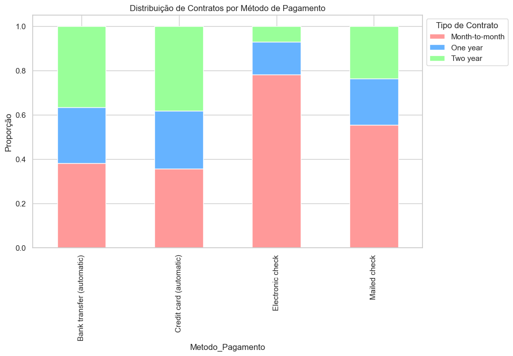
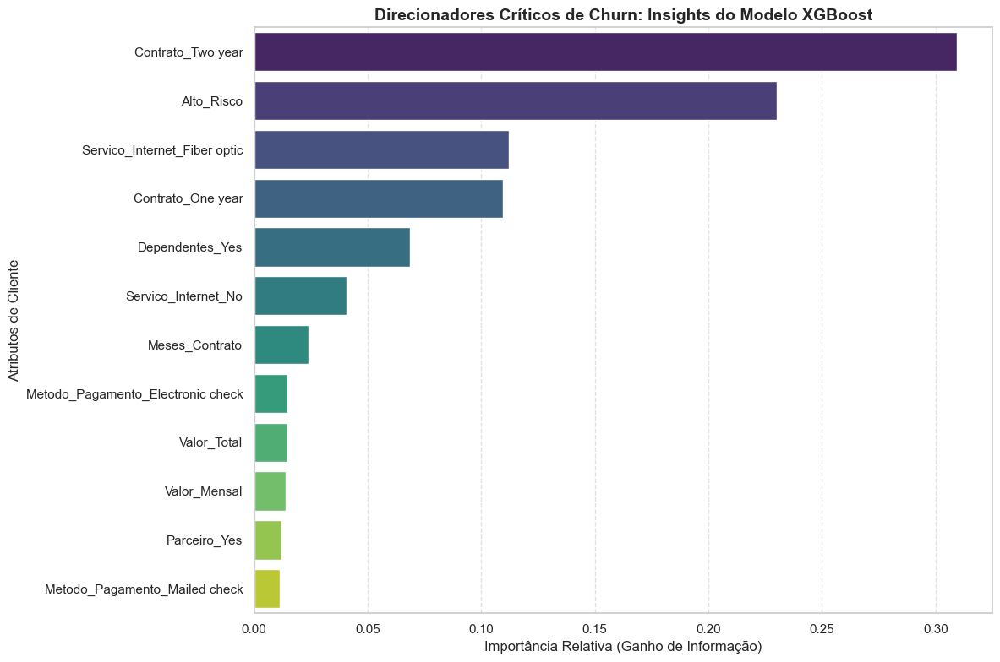

# Telco Customer Churn — Análise e Modelagem

Projeto de **análise exploratória** e **machine learning** para prever cancelamento (churn) de clientes de telecomunicações, com foco em impacto de negócio e retenção.

## Objetivo

Identificar clientes com alto risco de churn, entender os principais direcionadores e priorizar ações de retenção com base em modelos que maximizam o **recall** (captura de churners reais).

## Principais resultados

| Modelo         | Recall (churn) |
|----------------|----------------|
| Random Forest  | ~68,7%         |
| **XGBoost**    | **~78,6%**     |

Insights de negócio destacados no notebook:

- Contratos **month-to-month** concentram maior taxa de churn.
- Pagamento automático (cartão/transferência) associa-se a maior LTV.
- Variáveis como **meses de contrato**, **valor mensal** e **tipo de contrato** aparecem entre os maiores direcionadores no XGBoost.

## Visualizações

### Distribuição de contratos por método de pagamento



### Importância das variáveis (XGBoost)



> As imagens são geradas a partir dos outputs do notebook. Se a pasta `docs/images/` estiver vazia, execute `python scripts/extract_notebook_plots.py` após rodar o notebook.

## Estrutura do repositório

```text
.
├── telco_churn_analysis.ipynb       # análise principal (renomeie Untitled-1.ipynb)
├── notebooks/                       # atalho / instruções
├── data/
│   └── README.md                    # como baixar Telco_customer_churn.xlsx
├── docs/
│   └── images/                      # gráficos para o README
├── scripts/
│   └── extract_notebook_plots.py
├── requirements.txt
├── CHANGELOG.md
└── LICENSE
```

## Pré-requisitos

- Python 3.10+
- Dataset `data/Telco_customer_churn.xlsx` (ver [data/README.md](data/README.md))

## Instalação

```bash
python -m venv .venv
.venv\Scripts\activate          # Windows
pip install -r requirements.txt
```

## Como executar

1. Coloque o arquivo Excel em `data/Telco_customer_churn.xlsx`.
2. Abra o Jupyter:

```bash
jupyter notebook notebooks/telco_churn_analysis.ipynb
```

3. (Opcional) Exportar gráficos para o README:

```bash
python scripts/extract_notebook_plots.py
```

## Stack

- pandas, numpy, matplotlib, seaborn  
- scikit-learn, xgboost  

## Licença

MIT — veja [LICENSE](LICENSE).

## Changelog

Veja [CHANGELOG.md](CHANGELOG.md).
